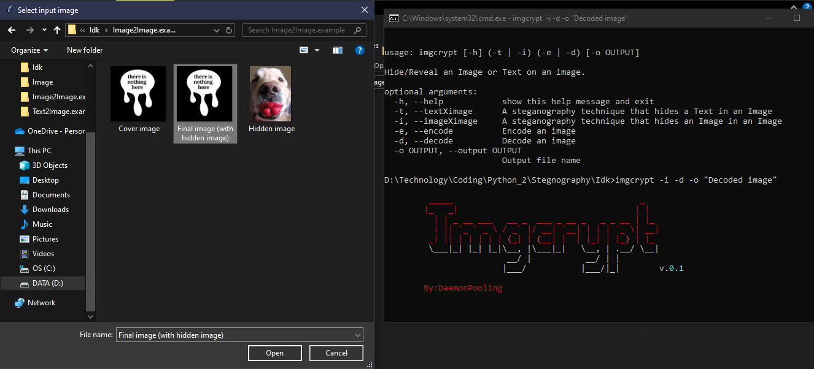

# Python steganography 🧙‍♂️
Hello! Ever heard something called steganography? Ever realize that you can hide an Image behind an Image? Well, that's what this python script does! By it's definition, [Steganography](https://en.wikipedia.org/wiki/Steganography) is the practice of representing information within another message or physical object, in such a manner that the presence of the information is not evident to human inspection. 💻 

Now, what can steganography even do? 
First of all, MANY THINGS! Example, if you feel like a troller😅, just as I do. You can hide a random images, while the image being covered with something. Or, take an instance where you want to share a peice of information to other people, you can hide the information through an image, although your friend should have the steganography tool aswell. 

And if you still don't know what it does. Why don't you have a try? It's really simple to use. 🚀🚀🚀

## ⁉ What's Inside?
- **Steganography tool:** This Python script allows you to combine an image with other image, or simply, hide a piece of text within an image. Often used for sharing something in a way that is not evident to human inspection.


## 🚀 How to Use?
**Imgcrypt.bat**

```
usage: imgcrypt [-h] (-t | -i) (-e | -d) [-o OUTPUT]

Hide/Reveal an Image or Text on an image.

optional arguments:
  -h, --help                    Show this help message and exit
  -t, --textXimage              A steganography technique that hides a Text in an Image
  -i, --imageXimage             A steganography technique that hides an Image in an Image
  -e, --encode                  Encode an image
  -d, --decode                  Decode an image
  -o OUTPUT, --output OUTPUT    Output file name
```

## 📜 Instructions:
1. **Clone the repository:**
```bash
git clone https://github.com/DaemonPooling/Python-steganography-CLI.git
```

2. **Navigate to the Project Folder:**
```bash
cd Python-steganography-CLI
```

3. **Install Dependencies:**
```bash
pip install -r requirements.txt
```

4. **Run imgcrypt.bat:**
```bash
imgcrypt -h 
```

## 🤸‍♀️ Exercise:
As for your exercise. You can try to Decode a files in `exercise/Image2Image.example` and `exercise/Text2Image.example`

### Image2Image:
Your target is to decode a file in `exercise/Image2Image.example/Final image (with hidden image).png`. To start off, simply follow this instructions!
1. Open your CMD (I assume you are on the Project folder, if not, go to the Project folder first.)
2. In your CMD, run this command line.
```bash
imgcrypt -i -d -o "Decoded image (you can change this whatever you want)"
```
3. And then choose the target file, and then wait!


4. If done, check the `Decoded image (...)` you got! And tell to yourself what you get

### Text2Image:
Just like in the **Image2Image** section, but this time. I want you to do it by yourself. I want you to decode `Final image (with hidden text).png` this time! If you still don't know how, you could check hint!
<details>
  <summary>Hint</summary>
  
  Just like in Image2Image. Just run this bash code! 
  ```bash
  imgcrypt -t -d -o "Decoded text"
  ```
</details>